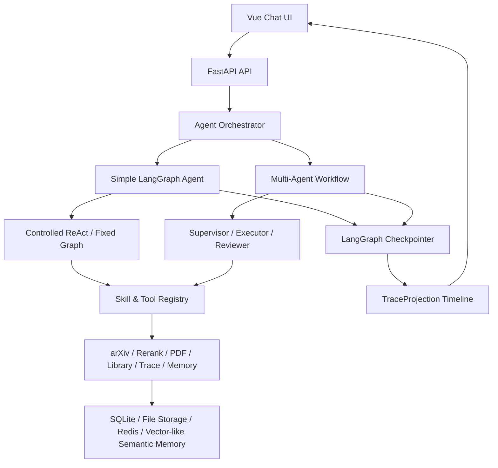

# arXiv Research Agent

面向 arXiv 论文检索、筛选、收藏、解析和订阅推送场景的科研论文工作流 Agent。项目以聊天入口为核心，结合 LangGraph 状态图、多 Agent 编排、受控 ReAct、Skill/Tool 分层、MCP 扩展、Redis 缓存和 Trace 可观测能力，实现从自然语言找论文到论文卡片、本地文献库、PDF 精读报告和任务链路追踪的一体化流程。

## 核心功能

- 自然语言检索 arXiv 论文，支持候选召回、重排和中文论文卡片生成。
- 支持论文收藏、PDF 下载、本地论文库管理和软删除。
- 支持 PDF 全文解析，生成结构化 Markdown 和中文精读报告。
- 支持单 Agent 简单任务和多 Agent 复合任务，例如搜索、对比、筛选、精读的组合请求。
- 支持短期会话记忆、长期结构化记忆和长期语义记忆，用于上下文指代和兴趣偏好增强。
- 支持 LangGraph Checkpointer、TraceProjection 和前端时间线，便于回放执行过程和定位失败节点。
- 支持 SSE 流式进度推送，长任务执行时前端可看到当前阶段。
- 支持 MCP Server，以标准 JSON-RPC over stdio 暴露论文检索、本地库和 Trace 查询能力。

## 流程框架



整体链路：

1. 用户在前端聊天页输入研究需求。
2. FastAPI 接收请求，创建 trace_id，并根据任务复杂度进入单 Agent 或多 Agent 流程。
3. 单任务走 LangGraph 固定业务图或受控 ReAct 子图；复合任务走 Supervisor、Executor、Reviewer、Composer 的多 Agent 状态图。
4. Agent 通过 Skill/Tool Registry 调用论文检索、重排、摘要、收藏、解析、对比、记忆和 Trace 查询等能力。
5. LangGraph Checkpointer 按 thread_id 保存状态快照，TraceProjection 将 checkpoint history 转成前端时间线。
6. 长任务通过 SSE 向前端推送阶段进度，最终返回论文卡片、报告或复合任务结论。

## 技术栈

**后端**

- Python, FastAPI, Pydantic, SQLAlchemy, SQLite, aiosqlite
- LangGraph, langgraph-checkpoint-sqlite
- sentence-transformers, PyTorch, BGE-M3 本地 Embedding
- Redis 可选缓存, httpx, APScheduler
- MCP Server, JSON-RPC over stdio

**前端**

- Vue 3, Vite, TypeScript
- Pinia, Vue Router, Element Plus
- Axios, marked, SSE/EventSource

## Agent 设计亮点

- **LangGraph 编排**：用共享 State、节点和条件边组织任务流程，支持固定论文搜索链路和动态 ReAct 子图。
- **多 Agent 工作流**：复合任务由 Supervisor 规划任务，Executor 调用 Skill/Tool 执行，Reviewer 检查完成度，FinalComposer 汇总输出。
- **受控 ReAct**：模型只负责基于 State 选择下一步动作，工具调用必须经过 Tool Registry 的 schema、权限和业务规则校验。
- **Skill/Tool 分层**：高层 Skill 封装稳定科研工作流，底层 Tool 承载 arXiv 搜索、重排、PDF 解析、本地库、记忆和 Trace 等原子能力。
- **混合 RAG 与记忆**：重排融合语义相似度、关键词、时效性和用户偏好；Embedding 异常时降级 TF-IDF。
- **缓存与可观测**：Redis 缓存 arXiv 搜索、Embedding/Rerank 和轻量 Workflow 状态；Trace 时间线记录节点、工具、参数、输出和错误。

## Skill / Tool / MCP

当前 Agent Registry 注册了 20+ 个可调用能力，包含原子 Tool 和高层 Skill。主要 Skill 包括：

- `paper_search_card_skill`：论文检索、重排、卡片摘要生成。
- `paper_deep_read_skill`：论文收藏、PDF 解析、精读报告生成。
- `paper_compare_skill`：多论文优缺点对比。
- `paper_select_best_skill`：根据任务目标和偏好选择最佳论文。
- `literature_survey_skill`：小型主题综述。
- `interest_recommendation_skill`：结合长期兴趣推荐论文。
- `memory_profile_skill`：读取或更新用户研究偏好。
- `trace_diagnosis_skill`：查询和诊断任务执行链路。

MCP Server 暴露 7 个标准工具接口：

- `arxiv.search_papers`
- `arxiv.get_paper_metadata`
- `library.search_papers`
- `library.get_paper`
- `library.get_report`
- `trace.query`
- `trace.get`

## 记忆系统

- **Working Memory**：LangGraph State，保存当前任务结构化状态。
- **Short-term Memory**：Messages List，保存当前会话上下文，并对 tool_call/tool_response 成对截断。
- **Long-term Structured Memory**：SQLite 保存用户偏好、论文库、订阅和 Trace。
- **Long-term Semantic Memory**：保存论文、报告和历史行为的语义索引，用于兴趣推荐和上下文增强。

## 评测结果

评测脚本位于 `backend/evaluation/`，结果输出到 `backend/evaluation/outputs/`。最近一次本地评测结果如下：

| 评测项 | 用例数 | 指标 |
| --- | ---: | --- |
| 意图识别准确率 | 60 | 91.67% |
| 任务派发准确率 | 60 | 91.67% |
| arXiv 检索 Recall@3 | 40 | 82.50% |
| arXiv API 成功率 | 40 | 100% |
| PDF 解析准确率 | 30 | 86.7% |


端到端评测中，BGE-M3 冷启动搜索耗时约 46.55s，预热后的搜索耗时约 13.35s。主要 token 消耗集中在论文卡片摘要、精读报告、多论文对比和 Supervisor 规划阶段。

## 启动方式

后端：

```powershell
cd backend
python -m venv .venv
.\.venv\Scripts\activate
pip install -r requirements.txt
uvicorn main:app --reload
```

前端：

```powershell
cd frontend
npm install
npm run dev
```

默认访问：

- 前端：http://localhost:5173
- 后端：http://localhost:8000
- 健康检查：http://localhost:8000/api/health

可选 Redis 缓存：

```env
REDIS_URL=redis://localhost:6379/0
```

如果不配置 Redis，缓存功能会自动降级，不影响主流程运行。

## 评测运行

```powershell
cd backend
python evaluation/run_eval.py --type all
python evaluation/run_e2e_agent_eval.py
```

支持的轻量评测包括：

- 意图识别与任务派发
- arXiv 检索 Recall@3
- PDF 解析正确率
- 单 Agent / 多 Agent 端到端耗时与 token 消耗

## 目录结构

```text
backend/
  app/
    agent/        LangGraph、ReAct、多 Agent、Skill/Tool Registry
    api/          FastAPI 路由
    services/     业务服务、记忆、缓存、TraceProjection
    tools/        arXiv、Rerank、PDF、LLM、本地库等工具
    models/       SQLAlchemy 数据模型
    schemas/      Pydantic 请求响应模型
  evaluation/     自动化评测脚本和测试集
  mcp_server/     MCP 工具、资源和 Prompt 暴露

frontend/
  src/
    views/        聊天、本地库、订阅、Trace、设置页面
    components/   论文卡片、时间线、报告查看等组件
    stores/       Pinia 状态管理
    api/          前端 API 封装
```
